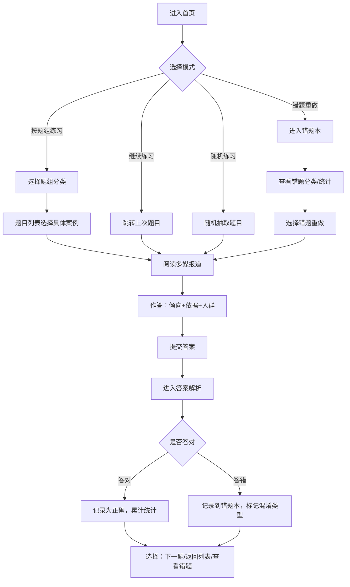

# 媒体倾向识别练习器 - 产品需求文档 (PRD)

## 1. 产品概述
面向高校新闻传播专业学生的纯前端实训工具，通过真实新闻报道样例训练学生识别媒体报道倾向的能力，培养舆情分析中的证据意识。
- 核心目标：通过结构化练习+深度解析+错题追踪三位一体，让学生掌握从措辞、消息源、选材角度识别媒体倾向（同情/追责/观望/引导质疑）的方法
- 适用场景：课堂小测、实训作业、个人复习、教学演示

## 2. 核心功能

### 2.1 用户角色
无需注册登录，纯本地练习工具，数据存储于浏览器 localStorage。

| 角色 | 使用方式 | 核心能力 |
|------|---------|---------|
| 学生用户 | 直接打开使用 | 进行案例练习、查看答案解析、管理错题本、练习统计 |

### 2.2 功能模块
1. **首页导航页**：三大模块入口（案例练习、答案解析、错题本），练习进度概览，题组分类选择
2. **案例练习页**：题组选择器、报道阅读区（多媒对比）、答题区（倾向选择+判断依据+影响人群）、提交校验
3. **答案解析页**：逐句措辞分析高亮、倾向判定依据拆解、常见误判点对比、同题其他媒体视角
4. **错题本页**：错题列表、混淆类型归类（事实陈述误判/忽略消息源/措辞敏感度不足等）、重做入口、学习统计

### 2.3 页面详情
| 页面名称 | 模块名称 | 功能描述 |
|---------|---------|-----------|
| 首页导航 | 统计卡片 | 显示已练习题数、正确率、错题数、连续练习天数 |
| 首页导航 | 题组分类 | 公共事件/企业危机/社会议题/国际报道 四类卡片，显示每类题数和完成进度 |
| 首页导航 | 快捷入口 | 继续上次练习、随机练习、错题重做 |
| 案例练习 | 题组选择 | 题目列表，每题显示事件标题、涉及媒体数量、难度标签 |
| 案例练习 | 多媒报道 | Tab切换不同媒体报道，展示标题、来源、发布时间、正文（标题/导语/关键段落） |
| 案例练习 | 答题表单 | 报道倾向单选（同情/追责/观望/引导质疑/中立客观）、判断依据多选（措辞选择/消息源/选材角度/标题暗示/数据引用）、影响人群多选 |
| 案例练习 | 提交交互 | 即时跳转答案解析，保存答题记录到本地 |
| 答案解析 | 答题结果 | 显示正确与否，得分环形图 |
| 答案解析 | 逐句分析 | 原文逐句高亮，hover显示措辞倾向标签和解释（同情词/追责词/模糊表述/引导性问句等） |
| 答案解析 | 判定依据 | 系统判定理由列表，每条配证据摘录 |
| 答案解析 | 误判对比 | 展示其他同学常见错误选项及原因分析（模拟统计数据） |
| 答案解析 | 媒体横向对比 | 同事件其他媒体报道倾向雷达图对比 |
| 错题本 | 混淆类型分类 | 按错误类型分组：事实陈述误判为负面/忽略消息源立场/措辞敏感度不足/中立与观望混淆/同情与引导质疑混淆 |
| 错题本 | 错题列表 | 每题显示：事件名称、错误选项vs正确答案、错误时间、错误次数 |
| 错题本 | 学习统计 | 各类错误占比饼图、正确率趋势折线图、薄弱点提示 |
| 错题本 | 重做功能 | 单题重做、按类型批量重做、全部重做 |

## 3. 核心流程

## 4. 用户界面设计

### 4.1 设计风格
- **主色调**：墨青色（#1a4a5e）作为主色，体现新闻专业的严肃感；搭配暖橙色（#e07b39）作为强调色，用于标记重要提示和正确选项
- **辅助色**：
  - 同情倾向：柔蓝色（#4a90d9）
  - 追责倾向：绯红色（#c94a4a）
  - 观望倾向：灰紫色（#8e7cc3）
  - 引导质疑：琥珀色（#d4a017）
  - 中立客观：森林绿（#3d8b5c）
- **按钮风格**：圆角8px，悬停有微上浮+阴影加深效果，主按钮使用渐变填充
- **字体选择**：
  - 标题：思源宋体（Source Han Serif SC），体现新闻编辑质感
  - 正文：思源黑体（Source Han Sans SC），保证可读性
  - 数据/标签：JetBrains Mono 等宽字体
- **布局风格**：卡片式布局为主，报道区采用报纸质感的双栏排版，答题区为清晰的单列表单
- **图标风格**：线性图标（stroke 2px），配合新闻主题元素（报纸、放大镜、铅笔、对话气泡）

### 4.2 页面设计概览
| 页面名称 | 模块名称 | UI元素 |
|---------|---------|--------|
| 首页导航 | 统计卡片 | 渐变背景卡片，数据大号数字+趋势小箭头，卡片悬停有轻微缩放动画 |
| 首页导航 | 题组分类 | 大卡片带分类图标，进度条显示完成比例，标签徽章显示题数 |
| 案例练习 | 多媒报道 | Tab栏带媒体Logo占位，正文区米色背景+首字下沉，关键段落左侧有色条标注 |
| 案例练习 | 答题表单 | 选项卡片式（非传统radio），选中有边框高亮+填充背景，多选标签为圆角chip |
| 答案解析 | 逐句分析 | 句子hover浮层，带箭头指向原文，高亮色块随倾向变色，过渡动画流畅 |
| 答案解析 | 误判对比 | 左右对比布局，错误选项侧有删除线+红底，正确侧有勾选+绿底 |
| 错题本 | 混淆分类 | 手风琴折叠面板，分类标题带错误次数badge，展开后显示该类下错题卡片 |
| 错题本 | 统计图表 | 使用CSS+SVG自绘饼图/折线图，配色与倾向色一致，动画填充 |

### 4.3 响应式
- 设计优先级：桌面端优先（适配教学场景，学生多使用电脑完成作业）
- 断点设置：1280px（默认桌面）、960px（平板横屏）、640px（平板竖屏/手机横屏）
- 移动端适配：报道阅读区改为单栏，答题选项堆叠，图表简化展示，保证触控区域≥44px

### 4.4 动效细节
- 页面加载：卡片依次渐入（stagger 80ms），数字从0滚动到目标值
- 答题提交：按钮展开环形进度条，然后平滑滚动到解析区域
- 逐句分析：鼠标移入句子时，高亮背景色从左到右过渡填充
- 错题重做：答对时卡片翻转动画后消失，答错时抖动提示
