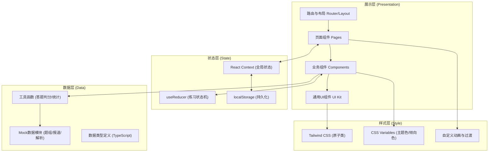

# 媒体倾向识别练习器 - 技术架构文档

## 1. 架构设计



## 2. 技术描述

- **前端框架**：React 18 + TypeScript 5
- **构建工具**：Vite 5 (极速冷启动+HMR)
- **样式方案**：Tailwind CSS 3.4 + PostCSS + CSS Variables
- **路由方案**：React Router v6（hash路由，便于纯静态部署）
- **图标方案**：Lucide React（轻量级，线性风格，与设计契合）
- **数据持久化**：浏览器 localStorage（JSON序列化，封装Storage工具类）
- **图表实现**：原生SVG + CSS动画（自绘饼图/折线图/雷达图，不引入额外图表库以保持轻量）
- **代码质量**：ESLint + Prettier（统一代码风格）

**技术选型理由**：
1. 纯前端无需后端，所有数据本地化存储，便于教师分发学生离线使用
2. Tailwind保证UI一致性和快速迭代，CSS Variables支持主题色动态切换
3. React Context管理练习/错题全局状态，避免过度使用状态管理库
4. 自绘SVG图表避免echarts/chart.js等重型依赖，首屏加载<200KB

## 3. 路由定义

| 路由 (Hash) | 页面组件 | 用途 |
|-------------|---------|------|
| `#/` | HomePage | 首页导航，统计概览+题组分类入口 |
| `#/practice` | PracticeListPage | 案例练习题组列表，按分类展示题目 |
| `#/practice/:id` | PracticeDetailPage | 具体案例练习页：报道阅读+答题 |
| `#/analysis/:id` | AnalysisPage | 答案解析页：逐句分析+误判对比 |
| `#/mistakes` | MistakesPage | 错题本：混淆分类+统计+重做 |
| `#/mistakes/review/:type` | MistakesReviewPage | 按类型批量重做错题 |

## 4. 数据模型

### 4.1 核心类型定义 (TypeScript)

```typescript
// 报道倾向枚举
type MediaTendency = 'sympathy' | 'accountability' | 'wait_and_see' | 'sceptical' | 'neutral';

// 题组分类
type QuestionCategory = 'public_event' | 'corporate_crisis' | 'social_issue' | 'international';

// 判断依据选项
type BasisOption = 'wording' | 'source' | 'angle' | 'headline' | 'data';

// 影响人群
type AffectedGroup = 'government' | 'corporate' | 'public' | 'vulnerable' | 'industry' | 'netizens';

// 混淆类型（错误分类）
type ConfusionType = 
  | 'fact_as_negative'      // 事实陈述误判为负面
  | 'ignore_source'         // 忽略消息源立场
  | 'wording_sensitivity'   // 措辞敏感度不足
  | 'neutral_vs_wait'       // 中立与观望混淆
  | 'sympathy_vs_sceptical'; // 同情与引导质疑混淆

// 单句标注（用于逐句分析）
interface SentenceAnnotation {
  id: string;
  text: string;              // 句子原文
  startIndex: number;        // 在正文中的起始位置
  endIndex: number;          // 在正文中的结束位置
  tendencyLabel?: MediaTendency; // 该句倾向标签
  annotation: string;        // 解释说明
  keywords: string[];        // 关键措辞列表
}

// 单篇媒体报道
interface MediaReport {
  id: string;
  mediaName: string;         // 媒体名称
  mediaLogo?: string;        // 媒体Logo（可选）
  publishDate: string;       // 发布日期
  headline: string;          // 标题
  lead: string;              // 导语
  keyParagraphs: string[];   // 关键段落
  fullText?: string;         // 全文（可选）
  overallTendency: MediaTendency; // 整体倾向
  sentenceAnnotations: SentenceAnnotation[]; // 逐句标注
  sourceStandpoint: string;  // 消息源立场分析
}

// 一道练习题（案例）
interface PracticeQuestion {
  id: string;
  title: string;             // 事件名称
  category: QuestionCategory;
  difficulty: 1 | 2 | 3;     // 难度：1简单/2中等/3困难
  summary: string;           // 事件背景简介
  reports: MediaReport[];    // 该事件下多篇报道
  // 标准答案
  correctTendency: MediaTendency;
  correctBasis: BasisOption[];
  correctAffectedGroups: AffectedGroup[];
  // 解析内容
  reasoning: string[];       // 判定理由列表
  commonMistakes: CommonMistake[]; // 常见误判点
}

// 常见误判记录
interface CommonMistake {
  wrongOption: string;       // 错误选项
  percentage: number;        // 模拟误判比例
  reason: string;            // 误判原因分析
  tip: string;               // 辨析提示
}

// 用户答题记录
interface UserAnswer {
  questionId: string;
  reportId: string;          // 针对哪篇报道作答
  selectedTendency: MediaTendency;
  selectedBasis: BasisOption[];
  selectedAffectedGroups: AffectedGroup[];
  isCorrect: boolean;        // 倾向是否判对
  score: number;             // 综合得分（0-100）
  answeredAt: number;        // 时间戳
  confusionType?: ConfusionType; // 错误分类（如果答错）
}

// 全局统计数据
interface UserStats {
  totalPracticed: number;
  correctCount: number;
  mistakeCount: number;
  categoryProgress: Record<QuestionCategory, { total: number; done: number }>;
  confusionDistribution: Record<ConfusionType, number>; // 各混淆类型计数
  dailyStreak: number;
  lastPracticeDate: string;
  history: Array<{ date: string; correct: number; total: number }>;
}
```

### 4.2 localStorage 键名约定

| Key | 数据结构 | 说明 |
|-----|---------|------|
| `mta_user_answers` | `UserAnswer[]` | 所有答题记录 |
| `mta_user_stats` | `UserStats` | 用户统计数据 |
| `mta_mistakes` | `Record<string, { count: number; lastWrong: number }>` | 错题错题表，key为questionId_reportId |
| `mta_last_question` | `string` | 上次做到的题目ID，用于"继续练习" |

## 5. 核心工具函数模块

### 5.1 判分引擎 (`src/utils/scoring.ts`)
```
calculateScore(userAnswer, correctAnswer, confusionClassifier)
  ├── 倾向判断 (40%)：完全匹配得满分
  ├── 判断依据 (35%)：与正确集合的Jaccard相似度换算
  ├── 影响人群 (25%)：同上Jaccard相似度
  └── classifyConfusion() → 答错时标记混淆类型
```

### 5.2 统计分析 (`src/utils/statistics.ts`)
```
computeStats(answers) → UserStats
  ├── 累计正确/错误统计
  ├── 混淆类型分布计算
  ├── 连续练习天数计算
  └── 按日期分组的正确率趋势
```

### 5.3 存储封装 (`src/utils/storage.ts`)
```
SafeLocalStorage<T>
  ├── get(key, defaultValue)
  ├── set(key, value)
  ├── remove(key)
  └── 带try-catch和版本号，防止JSON解析崩溃
```

## 6. Mock数据设计

预置 **8个真实案例**（每类2个），每个案例3-4篇不同立场的报道：

| 案例ID | 分类 | 事件名称 | 难度 | 报道数 |
|--------|------|---------|------|--------|
| q01 | 公共事件 | 某地暴雨内涝事件 | 2 | 4 |
| q02 | 公共事件 | 地铁安全事故通报 | 3 | 3 |
| q03 | 企业危机 | 某新能源汽车自燃事件 | 2 | 4 |
| q04 | 企业危机 | 食品品牌质量投诉事件 | 1 | 3 |
| q05 | 社会议题 | 年轻人延迟退休讨论 | 2 | 4 |
| q06 | 社会议题 | 学区房政策调整 | 3 | 3 |
| q07 | 国际报道 | 海外贸易摩擦谈判 | 2 | 3 |
| q08 | 国际报道 | 国际气候峰会成果 | 1 | 3 |

## 7. 性能与体验优化
- **首屏**：代码分割+路由懒加载，首屏仅加载首页组件
- **数据**：Mock数据分模块动态import，不随首屏打包
- **动画**：优先CSS transition/transform，避免JS动画阻塞主线程
- **存储**：答题记录去重（同题同报道取最新），限制历史记录最多500条
- **可访问性**：语义化HTML标签，键盘导航支持，颜色对比度≥4.5:1

## 8. 目录结构

```
src/
├── assets/              # 静态资源（字体、图标）
├── components/          # 通用业务组件
│   ├── ui/             # 基础UI：Button/Card/Tab/Chip/RadioCard等
│   ├── ReportViewer/   # 报道阅读组件（含逐句高亮）
│   ├── TendencyTag/    # 倾向标签组件
│   ├── StatsChart/     # 自绘SVG图表组件
│   └── layout/         # Header/Sidebar/导航等
├── context/            # React Context
│   └── AppContext.tsx  # 全局练习状态
├── data/               # Mock数据
│   ├── index.ts
│   ├── q01-*.ts ~ q08-*.ts
│   └── types.ts        # 类型导出
├── pages/              # 页面组件
│   ├── HomePage.tsx
│   ├── PracticeListPage.tsx
│   ├── PracticeDetailPage.tsx
│   ├── AnalysisPage.tsx
│   ├── MistakesPage.tsx
│   └── MistakesReviewPage.tsx
├── utils/              # 工具函数
│   ├── scoring.ts
│   ├── statistics.ts
│   └── storage.ts
├── hooks/              # 自定义Hooks
│   ├── useStats.ts
│   └── useMistakes.ts
├── styles/             # 全局样式
│   ├── globals.css     # Tailwind入口
│   └── theme.css       # CSS Variables定义
├── App.tsx
├── main.tsx
└── router.tsx
```
